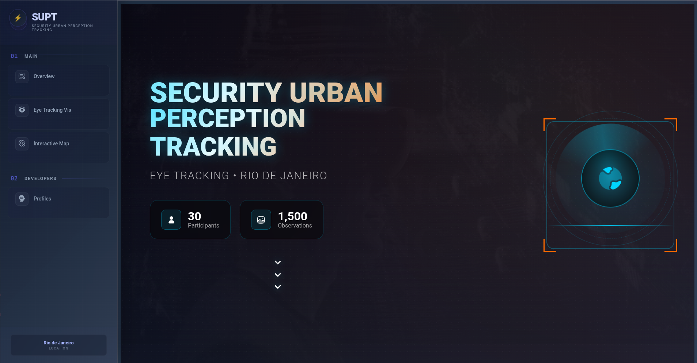

# Security Urban Perception Tracking

Final project developed for the Data Visualization course by students [Andres De La Puente](https://github.com/andresdlp05), [Luis Sante](https://github.com/LuisSante), y [Leandro Estrada](https://github.com/Leandr0ER).

Project Page: [https://fgv-vis-2025.github.io/final-project-security-urban-perception-tracking/overview/](https://fgv-vis-2025.github.io/final-project-security-urban-perception-tracking/overview/)

## Abstract
This project introduces a visual prototype centered on Urban Security Perception: a profound exploration into the results of an experiment on how participants of diverse nationalities perceive safety based on various urban images from the city of Rio de Janeiro. This application leverages visualization techniques, utilizing a range of intuitive interactive graphical objects, thereby enabling users to explore all possible characteristics derived from this experiment.

[Link to Paper](https://github.com/FGV-VIS-2025/final-project-security-urban-perception-tracking/blob/main/Final_Paper_SUPT.pdf) | [Link to Teaser Video](https://drive.google.com/file/d/1Fl3zPNC71CCgjNKnp_jwBXjfyvwcWDHn/view?usp=drive_link) | [Link to Demo Video](https://drive.google.com/file/d/1FjPUxiFVeqP3Ua9hQBAMXg8Xhx8kJwzG/view?usp=sharing)

## Project's Process
The group agreed to address the topic of Urban Perception, as one of the members is currently working on this research area. Furthermore, the availability of the dataset containing experimental results, along with comparative datasets from Place2Pulse and auxiliary datasets, sparked interest in developing a visual prototype as the final project.

The initial objectives were to create a page with an environment related to Security Urban Perception Tracking, designed for easy exploration, enabling the end-user to learn more about the general results of the experiment. Following various meetings, the idea evolved to provide new visual elements, allowing users to naturally discover hidden information.

Regarding the distribution of responsibilities among the members, in summary, Andrés exclusively handled the "Eye Tracking Vis" main tab, given his work on this specific topic. Conversely, Luis and Leandro were responsible for the "Overview" and "Interactive Map" tabs, incorporating improvements in project communication and the creation of geospatial objects. Additionally, the design of the project's environment (background color, animation) was managed by Luis, while the processing and enhancement of the data for the interactive map (using pandas, geopandas) were primarily undertaken by Leandro.

## Project' Design
The background design of the prototype was inspired by an environment related to tracking and police intelligence, aiming to evoke an aura of mystery. Upon exploring the first tab, one will observe a homogeneity in its content.

Conversely, when the user navigates through the subsequent two tabs, they will encounter various visualization objects: Tracking Analysis, Fixation Point Analysis, an Interactive Map, a Statistical Summary, a Correlation Graph, and a Chord Diagram.

## Peer Critique Feedbacks
Feedback from peer review and suggestions from the MVP presentation were incorporated, leading to improved organization and the addition of new, relevant visual elements in this project.

## Sources and References
* Place pulse Dataset: [MIT Place Pulse | Kaggle](https://www.kaggle.com/datasets/shubham6147/mit-place-pulse)
* Place pulse Overview: [MIT media lab](https://www.media.mit.edu/projects/place-pulse-1/overview/)
* Rio de Janeiro city GeoDataset: [Geodata BR | Github](https://github.com/tbrugz/geodata-br)
* D3 [D3.js](https://d3js.org/)
* Svelte Documentation: [Svelte Documentation](https://svelte.dev/docs)
* GeoPandas 1.1.0 [Geopandas](https://geopandas.org/en/stable/)
